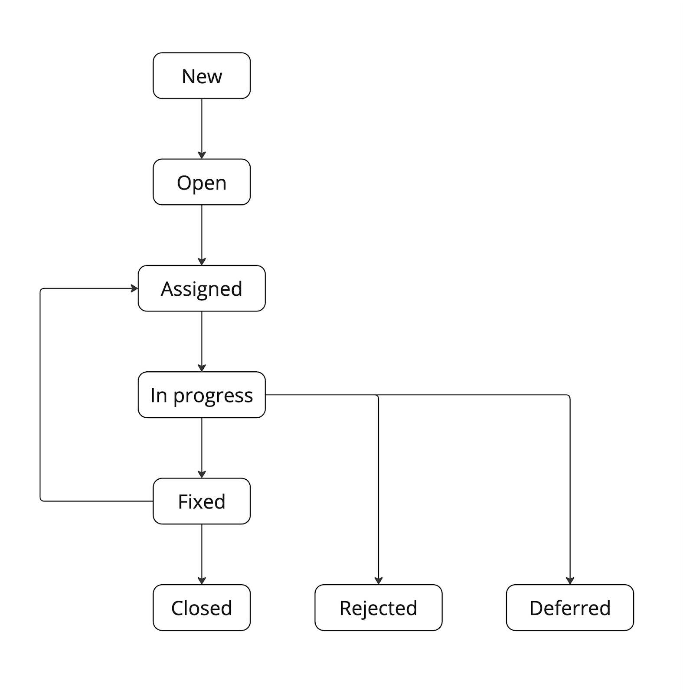

# Жизненный цикл баг-репорта

Жизненный цикл баг-репорта включает в себя несколько этапов, каждый из которых имеет свой статус и определенные действия, которые могут выполнять участники процесса. Ниже описаны основные статусы и их значения.

## 1. New (Новый)

Дефект создан, но в работу ещё не отправлен. На этом этапе тестировщик может уточнять детали или собирать дополнительную информацию о дефекте. Cтатус выставляется автоматически при создании баг-репорта.

## 2. Open (Открыт)

Дефект открыт (отдан в очередь на исправление). Статус выставляется тестировщиком при передаче дефекта в очередь. 

## 3. Assigned (Назначен)

Дефект закреплён за конкретным разработчиком. Технический руководитель или менеджер проекта назначает разработчика для работы над дефектом и выставляет статус.

## 4. In Progress (В работе)

Разработчик начал работу над исправлением дефекта. Этот статус указывает на то, что дефект активно рассматривается. Разработчик выставляет статус, когда начинает работу над дефектом.

## 5. Fixed (Исправлен)

Разработчик завершил работу над дефектом и считает его исправленным. На этом этапе может быть проведено тестирование исправления. Разработчик выставляет статус после завершения исправления и предоставляет информацию о внесённых исправлениях.

## 6. Closed (Закрыт)

Дефект закрыт и больше не требует внимания. Это финальный статус в жизненном цикле баг-репорта. Тестировщик выставляет статус после подтверждения исправления и завершения всех необходимых тестов.

## 7. Rejected (Отклонён)

Дефект не будет исправлен (не воспроизводится, не является дефектом и т.д.) Технический руководитель выставляет статус и причину отклонения.

## 8. Deferred (Отложен)
Исправление перенесено на более поздний срок. Менеджер проекта выставляет статус и указывает причину, и планируемую версию исправления.

